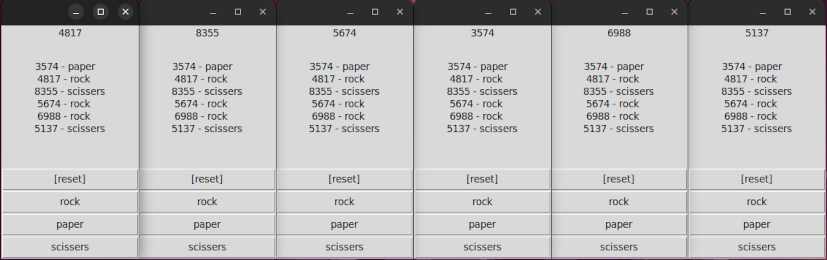

# Python, Practical Micro Code Examples
- ***Disclaimer**: The content of this repository is provided for learning purposes only and as a code example.*

## PyGame
- [Dot Shooter](dot_shooter/main.py)

## Tkinter
- [Online Rock, Paper, Scissers Game using Flask Web Service](rock_paper_scissers_online/runner.py)  

