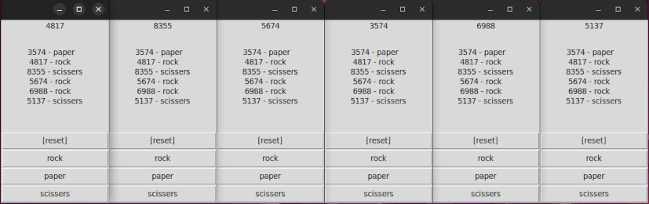

# Python Micro Code Examples
- ***Disclaimer**: The content of this repository is provided for learning purposes only and as a code example.*

## PyGame
- [Dot Shooter](games/dot_shooter/dot-shooter.py)

## Tkinter, Flask
- Online Rock, Paper, Scissers Game using Flask Web Service: [Runner](games/rock_paper_scissers_online/runner.py), [All Files](games/rock_paper_scissers_online/)  

----
## Older Uncategorized Examples
- Show triangles([1](/lessons/python/exercises/exercise-general-week-01-triangle.py),[2](/lessons/python/exercises/exercise-general-week-01-triangle-answer.py)) with python in terminal

- [TicTocToe](/exercises/01/hard-01-xo-game.py)
- [Dictionary](/exercises/exercise-general-week-05-01.py)
- Web ([1](/exercises/02/web/optional-01-flask.py),[2](/exercises/02/web/optional-02-flask.py))
- Turtle ([1](/exercises/02/turtle/optional-01-turtle.py),[2](/exercises/02/turtle/optional-02-turtle.py))
- [Genetic Algorithm](/lessons/algorithm/kinds/evolutionary/simple-genetic-algorithm.py)
- Rock Paper Scissors ([1](/exercises/02/gui/easy-01-rock-paper.py),[2](/exercises/02/gui/easy-02-rock-paper.py),[3](/exercises/02/gui/easy-03-rock-paper.py))
- Random Dice ([1](/exercises/02/gui/medium-01-random-number.py),[2](/exercises/02/gui/medium-02-random-number.py))
- Color Detector ([1](/exercises/02/gui/hard-01-color-detector.py),[2](/exercises/02/gui/hard-02-color-detector.py))
- PhoneBook ([1](/exercises/02/console/optional-01-phone-book.py))
- Simple 2D Ball Game [***DOCUMENTED***] ([1](/lessons/python/examples/simple-2d-game-part1.py), [2](/lessons/python/examples/simple-2d-game-part2.py), [3](/lessons/python/examples/simple-2d-game-part3.py), [4](/lessons/python/examples/simple-2d-game-part4.py))
- How to make a simple paint? ([First part](/lessons/python/examples/paint-part1.py))
- How to make a weight tracker? ([First part](/lessons/python/examples/weight-tracker-part1.py))
- How to make a simple phonebook with GUI? ([First part](/lessons/python/examples/phonebook-gui-part1.py))
- How to make an interpreter for a hypothetical programming language? ([First part](/lessons/python/examples/interpreter-part1.py))
- [Table generator](/lessons/python/examples/simple-table-generator.py) for Terminal
- Simple [service](/lessons/python/examples/simple-bad-practice-authenticator.py) to authenticate users, and a simple script to [login](/lessons/python/examples/simple-bad-practice-login-script.py) to this service.
- Simple "Rock", "Paper", "Scissors" Game with Socket [Client](/lessons/python/examples/simple-socket-client.py) and Socket [Server](/lessons/python/examples/simple-socket-server.py)
- Simple [talking bot](/lessons/python/examples/simple-talking-bot.py) example
- Simple [Maze](/lessons/python/examples/simple-cli-maze-generator.py) Generator
  - 
- Set [color in console](/lessons/python/concepts/enum/color-enum.py); how to [use](/lessons/python/examples/console-color.py) this.
- Simple [GET, POST](/lessons/python/examples/simple-get-post-service.py) service and also [Request1](/lessons/python/examples/simple-get-post-request.py), [Request2](/lessons/python/examples/simple-get-post-request2.py)
