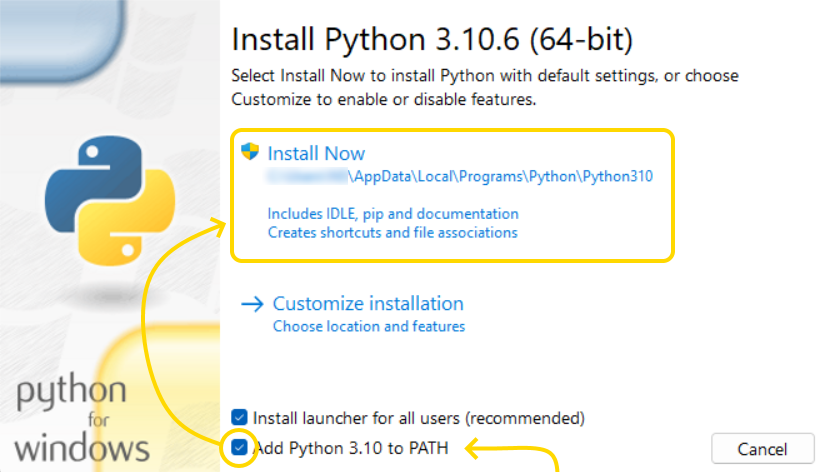

<h1>
نصب پایتون <a href="/README.md">برو به نسخه اصلی</a>
</h1>

<h2>برای اطمینان از نصب پایتون</h2>

یک ترمینال باز کنید
تایپ کنید `python` و دکمه اینتر را بزنید
اگر میتوانید چنین جمله ای در خروجی مشاهده کنید `Python 3.10.5` پایتون به شکل مناسب بر روی دستگاه شما نصب شده و نیازی به نصب مجدد آن نیست.

<h2>برای اجرای یک برنامه پایتون</h2>

**روش یک**
حتما نیاز به نصب نرم افزار خاصی نیست
بعد از اطمینان از نصب پایتون یک فایل با فرمت `.py` بسازید و برای مثال در درایو `C` به این شکل `c:\main.py` قرار دهید.
کدی که نوشته اید را در این فایل قرار دهید
برای اجرا یک ترمینال باز کنید و این کد را در ان تایپ کنید `python c:\main.py` و بعد دکمه اینتر را بزنید

**روش دوم**
اگر پایتون را به درستی نصب کرده باشید میتوانید در ویندوز به دنبال `IDLE` بگردید و کدهای پایتون را از طریق این نرم افزار اجرا کنید

**روش سوم**
ممکن است بتوانید بطور مستقیم با دابل-کلیک بر روی یک فایل `py` آن را اجرا کنید. برای تصحیح این فایل هم میتوانید از نوت پد، نوت پد ++ یا هر ادیتور دیگری استفاده کنید

<h2>چطور پایتون را به درستی نصب کنیم</h2>
پایتون را از سایت اصلی آن دانلود کنید
در زمان نصب پایتون یک تیک بیسار مهم باید علامت زده شود تا پایتون در سیستم عامل قابل دسترسی باشد

`Add python 3.10 to PATH`

<h2>نوت بوک جوپیتر</h2>

برای نصب جوپیتر یک ترمینال باز کنید و این کد را در ان اجرا کنید

`python -m pip install jupyter`

برای اجرای نوت بوک در ترمینال عبارت زیر را اجرا کنید

`jupyter notebook`

<h2>وی اس کد</h2>
اگر از `وی اس کد` استفاده میکنید 2 اکستنشن مهم را باید نصب کنید تا ویژگیهای مختلف پایتون و جوپیتر را در وی اس کد 
ببینید

