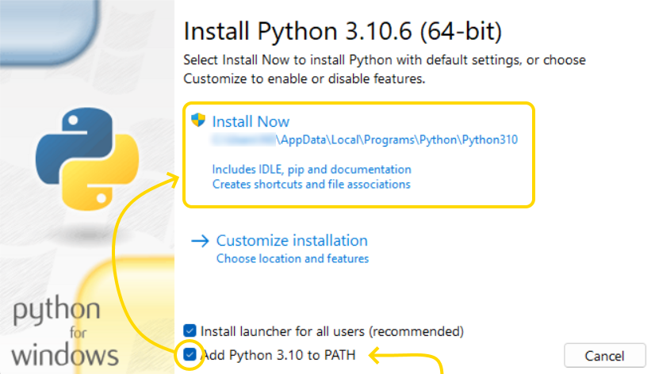

# Python Installation [Farsi Version](/README-FARSI.md)

- To check and run python:

  - Open a Terminal
  - Type `python` and press _ENTER_
  - If you can see something like this `Python 3.10.5 (tags/v3.10.5:f377153, Jun 6 2022, 16:14:13) [MSC v.1929 64 bit (AMD64)] on win32`, then you have python and you don't have to install it.

- To run python program:
  - Make a `.py` file for example in `c:\main.py`
  - Write your code inside `c:\main.py`
  - Open a terminal and type `python c:\main.py` to run your application directly

- To install python:
  - In Windows:
    - Download python from its official [website](https://python.org)
    - **Important**: At the time of installation of python, tick `Add python 3.10 to PATH` and then continue the installation.
    - 

## Jupyter Notebook

- To install `jupyter`, open a terminal (Search for `CMD` in windows) and type and enter this command: `python -m pip install jupyter` or simply use `pip install jupyter`
- Then to run your `notebook` open a terminal and enter this command: `jupyter notebook`

## VSCode

- Download and install vscode from its official [website](https://code.visualstudio.com/).
- After installing this you need to install extensions for **python** and **jupyter**
