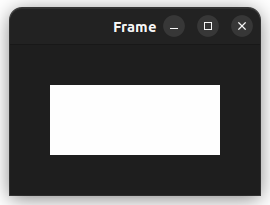

# Python
## Tkinter 
### Installation on Ubuntu
`sudo apt-get install python3-tk`

## Headings
- [Color Chooser](tkinter_color_chooser.py)
- [Message Box](tkinter_Message_box.py)
- [Open File Dialog](tkinter_open_file_dialog.py)
- [Ask Question](tkinter_ask_from_user.py)
- [Ask Question with Input](tkinter_ask_with_input.py)
- [Ask Question with Custom Input](tkinter_ask_with_custom_input.py)
- [Scrolled Text](tkinter_scrolled_text.py)
- [Drag and Drop (DnD)](tkinter_drag_and_drop.py) TODO: Complete this section
- Binds and Events TODO: Complete this section
  - [Mouse Key Events](tkinter_bindings.py)
  - [Mouse Move Events](tkinter_mouse_motion.py)
  - [Keyboard Events](tkinter_keyboard_events.py)
  - [General Events](tkinter_general_events.py)
- Layouts
- Widget
  - 

<strong>List of Widgets</strong>

  
    - [Frame](tkinter_frame.py)
      - 
    - [Entry](tkinter_entry.py)
      - 
    - [Label](tkinter_label.py)
      - 
    - [Button](tkinter_button.py)
      - 
    - [Image](tkinter_image.py)
      - 
  
    

  - 

<strong>Geometry Managers</strong>

      - [Pack](tkinter_geometry_manager_pack.py)
        - 

<strong>Options</strong>

    
          - `anchor="center", "n", "e", "ne", "nw", "s", "se", "sw", "w"`
          - `side="top", "bottom", "left", "right"`
          - Internal Padding
            - `ipadx=N`, `ipady=N`
          - External Padding
            - `padx=N`, `pady=N`
          - `expand=True, False`
          - `fill="none", "both", "x", "y"`

          

        - 
      - [Grid](tkinter_geometry_manager_grid.py)
        - 

<strong>Options</strong>

    
          - `row=N`, `rowspan=N`
          - `column=N`, `columnspan=N`
          - Internal Padding
            - `ipadx=N`, `ipady=N`
          - External Padding
            - `padx=N`, `pady=N`
          - `sticky="n", "e", "ne", "nw", "s", "se", "sw", "w"` and `"ns", "ew"`

          

        - 
      - [Place](tkinter_geometry_manager_place.py)
        - 

<strong>Options</strong>

    
          - `anchor="center", "n", "e", "ne", "nw", "s", "se", "sw", "w"`
          - `bordermode="outside", "inside"`
          - `x=N`, `y=N`
          - `relx=0-1`, `rely=0-1`
          - `width=N`, `height=N`
          - `relwidth=0-1`, `relheight=0-1`

          

        - 
    

  - [Find config of a widget](tkinter_widget_find_config.py)
  - Tk Options  TODO: Complete this section
    - `color`, `cursor`, `distance`, `font`, `geometry`, `justify`, `region`, `relif`, `scrollcommand`, `wrap`

## Note:
- [ ] TODO: Continue reading the [Official Link](https://docs.python.org/3/library/tkinter.html) 
- [ ] TODO: Read more about [TTK](https://docs.python.org/3/library/tkinter.ttk.html#module-tkinter.ttk)
- [ ] TODO: Read more about [Winfo](https://www.tcl.tk/man/tcl8.6/TkCmd/winfo.html)